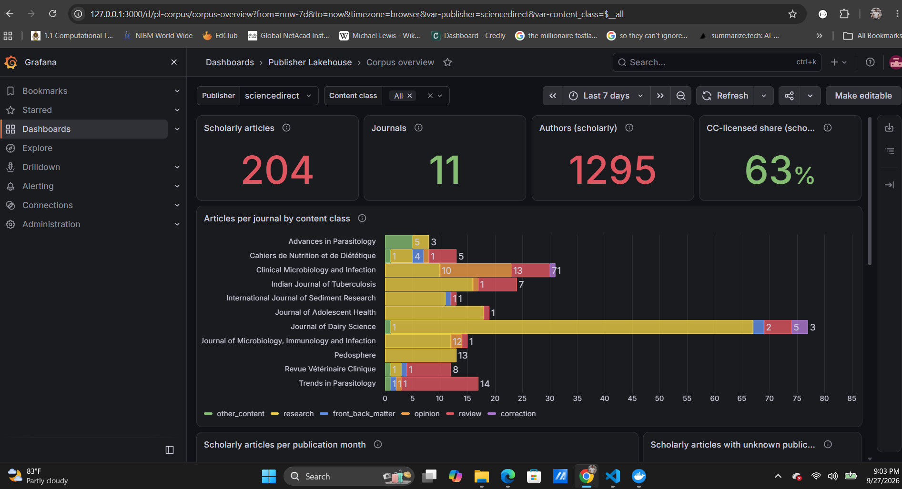
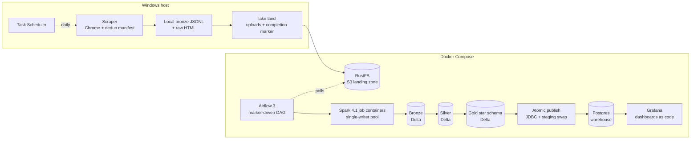
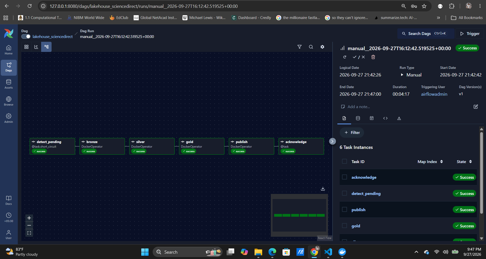
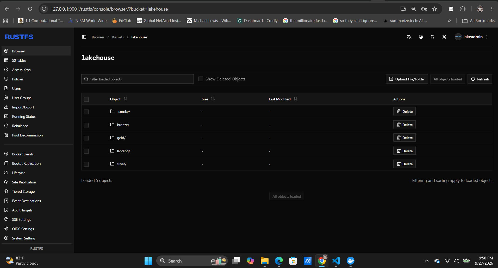
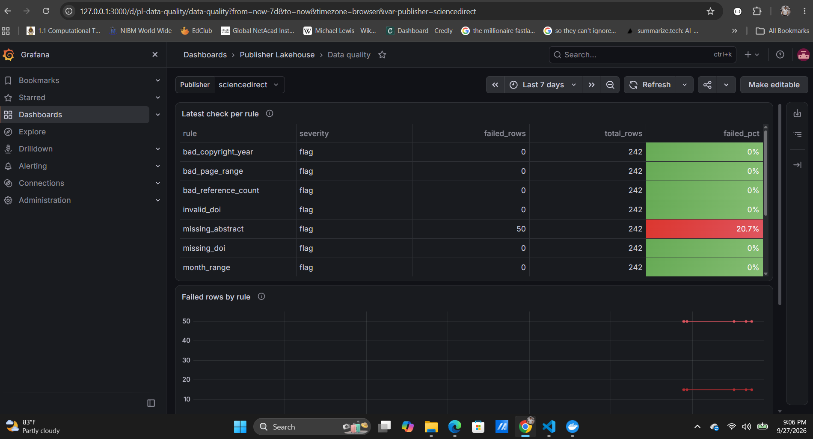
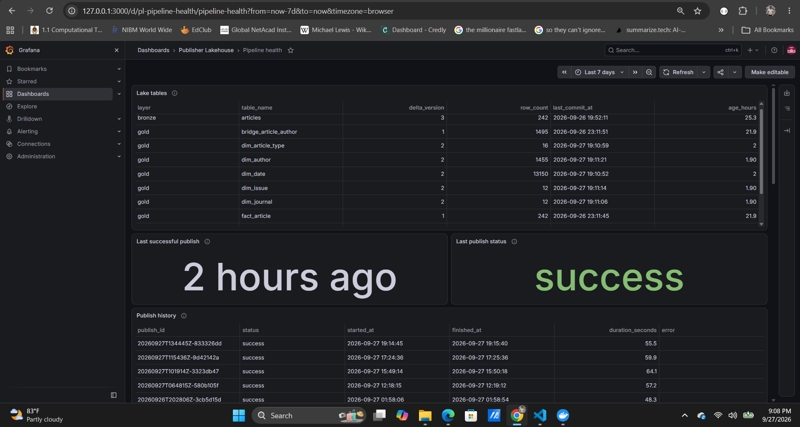
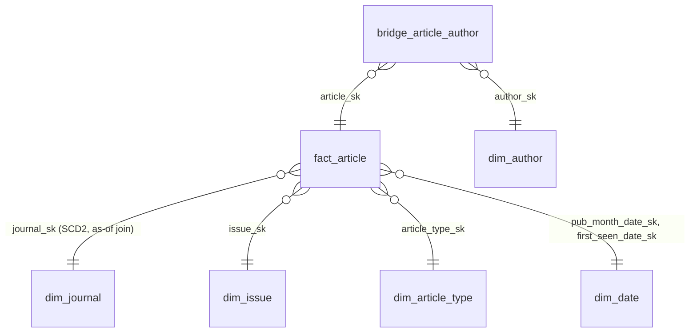

# Publisher Lakehouse

**An end-to-end, containerised data platform for academic-journal metadata.**
Browser-based ingestion lands data in an S3 object store. Spark jobs build
Delta Lake bronze, silver and gold layers, ending in a Kimball star schema.
Gold is published atomically to a Postgres warehouse and explored in Grafana.
Airflow orchestrates the lake, and every job is idempotent and covered by
tests.




> **Small data, production patterns.** The current dataset is deliberately
> small: one publisher, 11 journals, 242 articles and about 1,450 authors,
> all on one machine. The point is the engineering: idempotent incremental
> loads, change detection, slowly changing dimensions, data-quality
> enforcement, consistent serving, orchestration and observability,
> working end to end and verified by tests.

---

## Architecture



The scraper needs a real browser session, so it stays on the host as a
**producer**. The lakehouse is the **consumer**. The only handoff between them
is a completion marker in object storage. If Airflow is down, the marker waits
in storage; if a marker is processed twice, every job simply skips.

### How data moves

| Step | What happens | Key guarantee |
|---|---|---|
| **Ingest** | The scraper fetches journal → issue → article pages. A Postgres manifest decides what to fetch. | Articles already captured are never refetched inside the freshness window |
| **Land** | `lake land` mirrors new files to the S3 landing zone, then writes a marker. | The marker is written last, so a marker always means complete data |
| **Bronze** | Landed JSONL is loaded into an append-only Delta table with an insert-only `MERGE`. | A rerun inserts nothing; `delta.appendOnly` forbids updates and deletes |
| **Silver** | Latest version per article; typed, cleaned, quality-checked. Hash-diff `MERGE`. | Hard-rule failures go to quarantine; every check is logged to `dq_results` |
| **Gold** | Kimball star schema, with referential-integrity checks after every build. | SCD Type 2 journals; deterministic surrogate keys, with a collision guard |
| **Publish** | Gold is copied to Postgres at pinned Delta versions and swapped in one transaction. | Dashboards never see partial or mixed-version data |
| **Orchestrate** | An hourly DAG processes pending markers in immutable, commit-labelled job images. | One writer at a time, across every DAG |
| **Maintain** | A weekly DAG runs `OPTIMIZE` to compact small files. | Row checksums are verified unchanged |

---

## Engineering highlights

- **Idempotent by construction.** Every job plans its inserts, updates and
  deletes first. If there is nothing to do it skips the write, so a rerun
  leaves every Delta table version exactly as it was. After a write, Delta's
  commit metrics must match the plan, or the job fails.
- **Self-healing silver.** Each silver row carries a hash of its content.
  The hash-diff `MERGE` updates changed articles, picks up changes to the
  transform code, and reverts manual edits.
- **Data quality as data.**
  - Hard rules send rows to a quarantine table.
  - Soft rules become flags on each row.
  - Every rule's result is logged per run and charted in Grafana.
- **Kimball modelling.**
  - A **Type 2** journal dimension, joined *as of* each article's capture time.
  - A **role-playing** date dimension.
  - A **weighted** author bridge, so author counts never double-count papers.
  - Deterministic hash surrogate keys, and **unknown members** so rows with
    missing references aren't lost.
  - Article-type classification kept as reference data in code.
- **Consistent serving.**
  - Publish reads each Delta table *as of* the version it records in its log.
  - It stages everything, then swaps all tables in a single Postgres
    transaction.
  - Row counts and orphan-key checks are verified after every commit.
  - The four analytical queries return identical results in Spark and in
    Postgres.
- **Orchestration.**
  - Completion markers are acknowledged only after a successful publish.
  - Job images are immutable and labelled with their git commit.
  - A one-slot pool enforces Delta's single-writer assumption.
  - Secrets reach job containers only through `private_environment`, so the
    Airflow UI never renders them.
- **Dashboards as code.**
  - The data source is provisioned and connects through a least-privilege
    read-only role.
  - Saving from the browser is blocked.
  - A verification script calls Grafana's API to run every panel query and
    check cross-panel invariants. For example: the monthly bars plus the
    unknown-month count must equal the scholarly total.
- **Local security posture.** Every port is bound to `127.0.0.1`. Secrets live
  only in `.env`, which is gitignored. The job image's build context is an
  allowlist.

---

## Screenshots

| Airflow: marker-driven lakehouse DAG | Object store: lake layout |
|---|---|
|  |  |

| Data quality | Pipeline and scraper health |
|---|---|
|  |  |

---

## Data model



| Table | Grain |
|---|---|
| `fact_article` | One row per current article: reference, page, author and keyword counts, plus quality flags |
| `dim_journal` | One row per journal **version**, with `effective_from`, `effective_to` and `is_current` |
| `dim_issue` | One row per issue |
| `dim_article_type` | One row per article type, with its content class and whether it counts as scholarly |
| `dim_author` | One row per normalised author name |
| `dim_date` | One row per calendar day, 2000–2035 |
| `bridge_article_author` | One row per article × role × position, with a weight of 1 / number of authors |

---

## Tech stack

| Area | Technology |
|---|---|
| Ingestion | Python, zendriver (Chrome automation), BeautifulSoup, Pydantic, structlog, Typer |
| Metadata store | PostgreSQL 16 (dedup manifest), SQLAlchemy, Alembic |
| Object storage | RustFS 1.0 (S3-compatible), boto3, Hadoop S3A |
| Processing | Apache Spark 4.1 (PySpark), Delta Lake 4.4 |
| Serving | PostgreSQL 17 warehouse, Spark JDBC, psycopg 3 |
| Orchestration | Apache Airflow 3.3 (LocalExecutor, DockerOperator), Windows Task Scheduler |
| Visualisation | Grafana 13 (provisioned data source and dashboards) |
| Platform | Docker Compose, PowerShell |
| Quality | pytest with moto and containerised Spark tests, data-quality rules, Grafana API checks |

---

## Repository layout

```
publisher_lakehouse/
  ingestion/      scraper, browser session, record assembly, bronze writers
  manifest/       dedup manifest: models, repository, refresh policy
  landing/        S3 landing sync and completion markers
  transform/      Spark jobs: bronze, silver, gold, publish, maintenance
  ops/            scraper-health push to the warehouse
dags/             Airflow DAGs: lakehouse (hourly) and maintenance (weekly)
docker/           Spark image, warehouse init, Grafana provisioning and dashboards
scripts/          producer, task registration, job-image build, Grafana checks
tests/            host test suite (no Spark needed)
tests_spark/      Spark tests that run inside the job container
docs/             runbook, development log, screenshots
```

---

## Quick start

Full operating instructions are in [docs/RUNBOOK.md](docs/RUNBOOK.md). A first
run on Windows looks like this:

```powershell
# 1. Python environment and configuration
python -m venv .venv
.\.venv\Scripts\python.exe -m pip install -e ".[test]"
Copy-Item .env.example .env        # then replace every placeholder with your own values

# 2. Manifest database (local PostgreSQL 16)
.\.venv\Scripts\python.exe -m alembic upgrade head

# 3. Platform services, storage first
docker compose up -d objectstore warehouse
docker compose up -d grafana
docker compose up -d airflow-db airflow-init
docker compose up -d airflow-apiserver airflow-scheduler airflow-dag-processor
.\scripts\build_job_image.ps1

# 4. Produce data: scrape three journals, land them, push scraper health
.\scripts\producer.ps1 -Publisher sciencedirect -Limit 3
```

Then open:

| Service | URL |
|---|---|
| Airflow | http://127.0.0.1:8080. Unpause `lakehouse_sciencedirect`; it runs hourly, or trigger it now |
| Grafana | http://127.0.0.1:3000, folder **Publisher Lakehouse** |
| Object store console | http://127.0.0.1:9001/rustfs/console/index.html |

> Several services store their admin password the first time they start, so
> fill in `.env` before step 3. See the runbook for rotating credentials,
> backups and recovery.

---

## Testing

```powershell
# Host suite: no Spark or Docker required
.\.venv\Scripts\python.exe -m pytest -q

# Spark suite, inside the job container on local paths
docker compose run --rm --no-deps spark python -m pytest -q -p no:cacheprovider tests_spark

# Live dashboard verification through Grafana's API
.\.venv\Scripts\python.exe scripts\check_grafana.py
```

At v1.0, the host suite passes **299 tests** (10 skipped; they need a live
manifest database or Jinja) and the Spark suite passes **22** (1 skipped; it
needs the live warehouse). `check_grafana.py` runs every panel query and
checks the invariants, with 0 failures.

---

## Project status

**v1.0: the single-publisher platform is complete**, from scheduled scraping to
dashboards.

**Known limitations**
- Runs on one machine. Delta tables assume a single writer, which Airflow's
  pool enforces.
- Author identity is name-based (no ORCID), so namesakes merge and spelling
  variants split.
- The manifest records article rows only, so journal-level scraper health
  comes from gold freshness instead.
- The PowerShell scripts are tested on Windows PowerShell 5.1, not 7.

**Next**
- An adapter for an open metadata source (OpenAlex or Crossref), so the
  platform can run end to end without a browser.
- CI with GitHub Actions for the host and Spark test suites.
- Additional publishers, reusing the same bronze contract.

---

## Documentation

| Document | Contents |
|---|---|
| [docs/RUNBOOK.md](docs/RUNBOOK.md) | Start and stop, the daily flow, exit codes, recovery recipes, backup and restore, maintenance |
| [DEVIATIONS.md](DEVIATIONS.md) | Every design decision and trade-off, with the reason for it |
| [docs/DEVELOPMENT_LOG.md](docs/DEVELOPMENT_LOG.md) | The gate-by-gate build history and verification evidence |